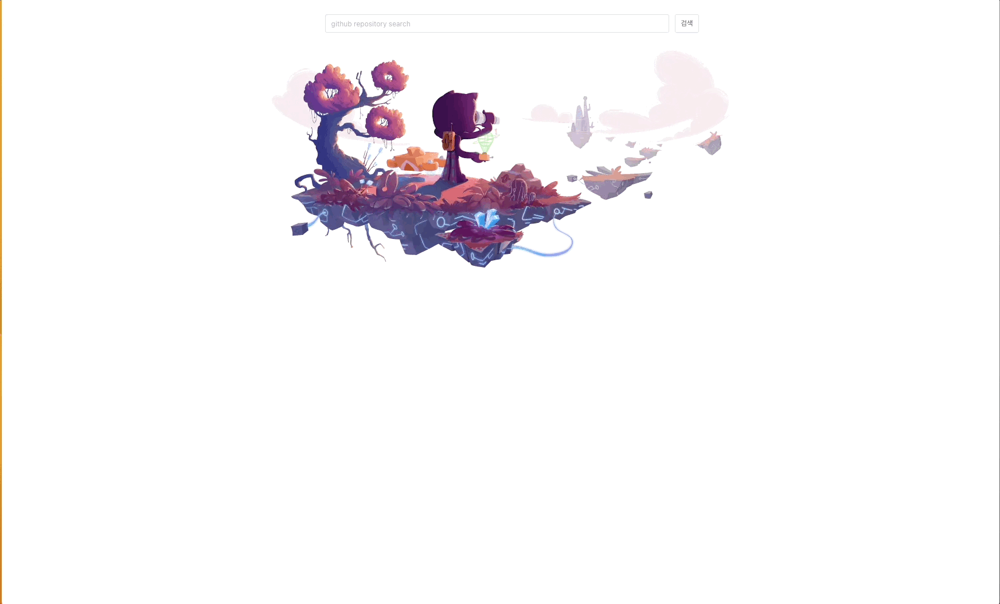
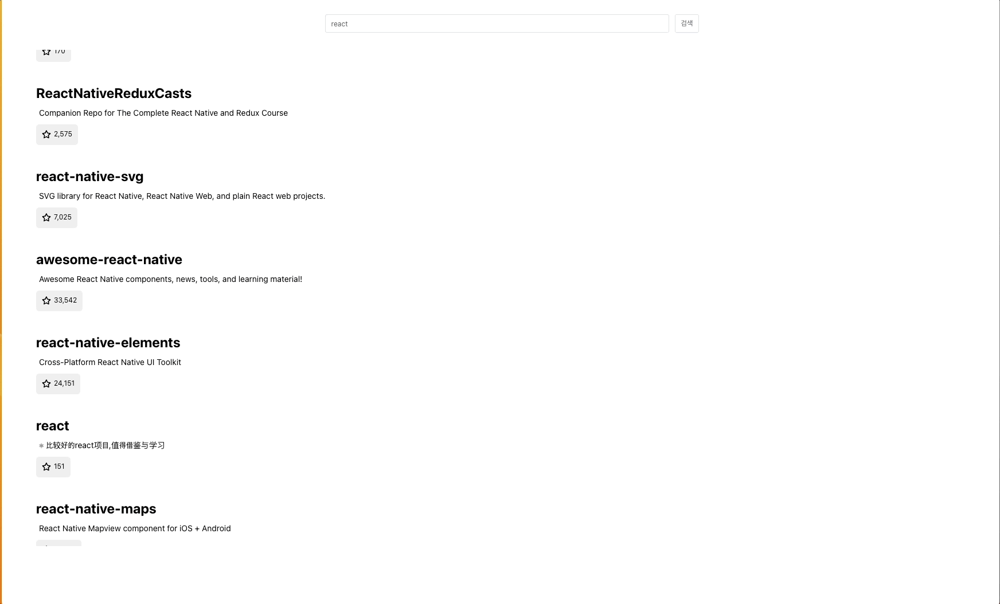

# Github Search

Relay를 사용하여 Github GraphQL API를 통한 검색 페이지를 구현합니다.




## 배포

### https://github-search-alpha-one.vercel.app/

## Getting Started

```
npm install
npm start
```

### .env 설정

```
REACT_APP_GITHUB_TOKEN =  ${Your github token}

```

## 구현해야하는 주요 기능

- [x] `Query.search` 필드 리졸버를 이용한 레포지토리 검색
  - `useLazyLoadQuery` 와 `usePaginationFragment` 를 이용해서 레포지토리 데이터를 가지고 왔습니다.
- [x] `<input />` 폼을 이용한 검색
- [x] 검색 결과 페이지네이션 (cursor based pagination)
  - `usePaginationFragment` 를 활용해서 `first` . `after` cursor 대신 `loadNext` , `hasNext`, `isLoadingNext`를 활용해 페이지네이션를 구현했습니다.
- [x] 아래 Mutation을 이용하여 검색된 레포지토리에 스타 추가/제거 토글 버튼 (`Mutation.addStar` , `Mutation.removeStar`)
  - `useMutation` 를 활용해서 click 이벤트와 loading 상태를 파악하여 토글 버튼 기능을 완성했습니다.

## 기타사항

- [x] JavaScript, TypeScript, ReScript 중 하나의 언어로 구현해주세요.
- [x] 스타일 관련 제한 사항 혹은 요구 사항은 없습니다. 편하신 방법으로 필요한 만큼 스타일을 추가해주세요.
- [x] Create-React-App 혹은 Next.js 로 구현해주세요.
- [x] 구현 내용을 확인할 수 있도록 Github 공개 레포지토리를 준비해주세요.
  - [x] 실행할 수 있는 방법을 README.md에 문서화 해주세요.

---

## 사용한 기술 스택

- Language: TypeScript
- Library: React, relay, graphql
- Styling: emotion

---

## Sincere-Thanks

GraphQL apollo를 활용해서 GraphQL를 공부하고 작게 실습해 본 경험만 있었습니다. 이번에 relay를 처음으로 사용해 보았습니다. 개념을 이해하고 기능을 구현할 때 어색하고 이해되지 않는 몇몇 부분이 있었지만 Github GraphQL api 문서와 relay 공식 문서를 보고 완성했습니다.
